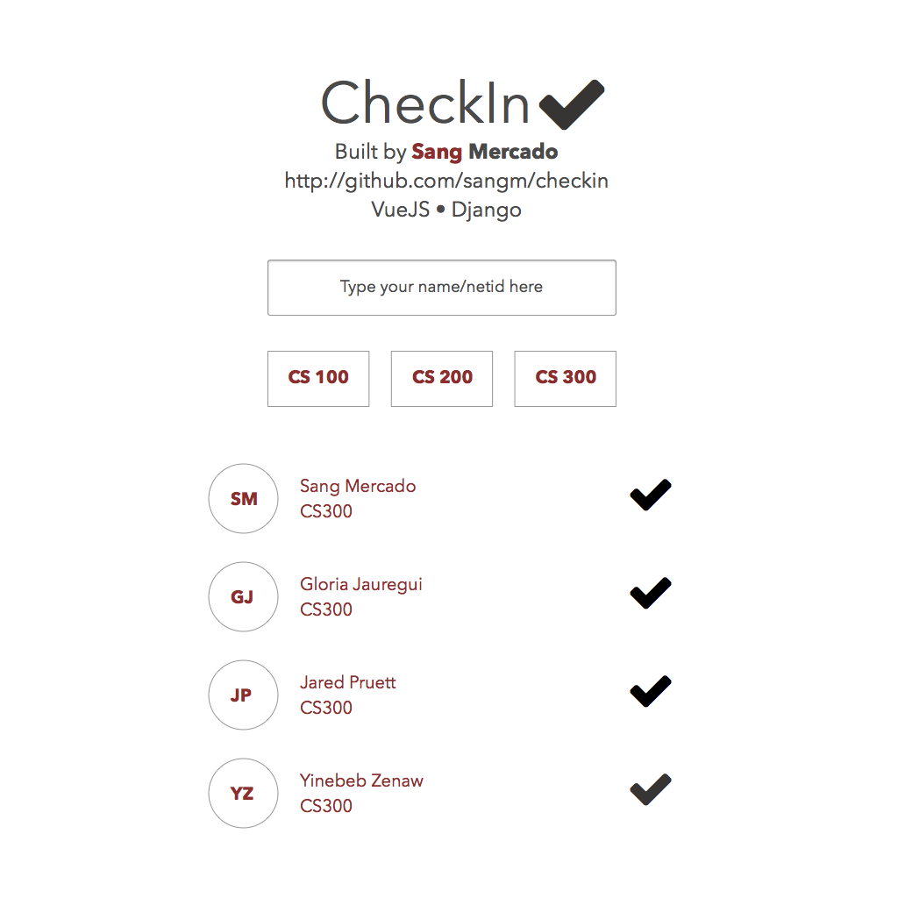

# CheckIn

Full Stack Django+MySQL/(AngularJS/VueJS) Application

Deployed on `Fedora` 

Some of the documentation may refer specifically to Fedora and may not convert to Debian/Ubuntu platforms.



## Virtualenv
+ install virtualenv
+ If you are on a server you will need development tools/mysql-devel/python-devel
+ On Fedora 23 I had to run the following commands

```bash
dnf install python-devel mysql-devel redhat-rpm-config
dnf groupinstall "Development Tools"
```

```bash
virtualenv env
source env/bin/activate
pip install -r requirements.py
```

## Httpie
it would be convenient to have this nifty little tool! `pip install httpie`

## MySQL/MariaDB Setup
### Docker
+ install docker [Docker](https://www.docker.com)
+ follow instructions on [Docker MariaDB](https://github.com/tutumcloud/mariadb)
+ to get list of docker machines running `docker-machine ls`
+ to get IP address of specific docker machine `docker-machine ip NAME`
+ The address from command above + 3306 as port is where the local MySQL/MariaDB will be!

### Server
+ install `MySQL/MariaDB` depending on your distro

### Setup mock data
+ modify databse settings under `checkIn/checkIn/settings.py` `
+ run `python manage.py syncdb` it will ask you to make a superuser, do it
+ Find the bash script under `checkIn/checkIn/sql_setup`
+ Edit the user/password/host/port/db fields and run the script
+ Under the same directory as manage.py, run the following commands

`pythonsh
python manage.py shell

from rest.utils import *
save_students()
save_courses()
save_student_courses()
```

## Tests
+ `python manage.py test`
+ `http -a SUPERUSER:SUPERUSERPASSWORD http://localhost:8000/v1/`
+ `http -a SUPERUSER:SUPERUSERPASSWORD http://localhost:8000/v1/students`

## Deployment
+ Install nginx
+ Check to see if gunicorn will work locally `gunicorn --bind 0.0.0.0:8080 checkIn.wsgi:application`
+ Modify the `gunicorn.service` file and put it under systemd directory `/etc/systemd/system/`
+ move the `checkin.nginx.conf` file to `/etc/nginx/conf.d` (default)
+ as root `systemctl start gunicorn`
+ `ps aux | grep gunicorn` to see if the process is running


## Obtaining Token
+ I use httpie to send POST request, it's trivial to convert the following command to curl if you do not want to 
install it
+ create a super user if you haven't `python manage.py createsuperuser`
+ replace SUPERUSER/SUPERPASSWORD with superuser credentials `http POST http://localhost:8000/api-token-auth/ username=SUPERUSER password=SUPERUSERPASSWORD`
+ The token is used to authenticate front end applications

## Resources
+ I generated mock data from website: [Mockaroo](https://www.mockaroo.com)
